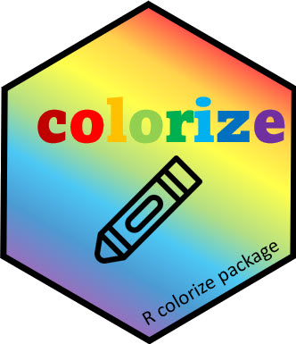

<!-- README.md is generated from README.Rmd. Please edit that file -->

<!-- badges: start -->

[](https://lifecycle.r-lib.org/articles/stages.html#experimental)
[](https://github.com/friendly/colorize/)
<!-- badges: end -->

# colorize

**Version 0.2.0**


The `colorize` package provides some simple functions for printing text
in color in markdown or Quarto documents, to be rendered as HTML or
LaTeX.

This is useful when writing about the use of colors in graphs or tables,
where you want to print their names in their actual color to give a
direct impression of the color, like “red” shown in
<span style="color: red;">red</span>, or “blue” shown in
<span style="color: blue;">blue</span>. This is similar to the use of
*direct labels* in graphs, which are perceptually bound closely to what
is portrayed, rather than an *indirect legend*, which takes more
cognitive energy to see what data in referred to in the graph.

The following functions are provided:

- `colorize(text, color)`: Print the `text` in a given `color`, as in
  <span style="color: red;">this text in red</span>
- `colorize_bg(text, color)`: Print the `text` with a background in
  `color`, as in <span style="background-color: red;">this text in
  red</span>
- `colorbox(text, color, ...)`: Print `text` with background in color,
  but where the text is given a contrasting color designed to be most
  legible, as in
  <span style="background-color: #FF0000; color: #FFFFFF; padding: 2px">this
  text in red</span>

In the examples above, note the difference between `colorize_bg()` and
`colorbox()`: when the desired color is
<span style="color: red;">red</span>, `colorbox()` uses a lighter color
(white) so the text contrasts more with the darker background.

This is somewhat similar to what RStudio does when you enter color names
or hex values in code, but `colorbox()` uses
`colorspace::contrast_ratio(textcolor, color, ...)` to find the
`textcolor` that **contrasts best** against the background `color`.


The uses of color for text in visualization is far more general than
represented here. Brath (2020) is a wonderful source for inspiration!

## Installation

`colorize` is not yet on CRAN. You can install the development version
of colorize from either the GitHub repo or r-universe, as follows:

``` r
remotes::install.github("friendly/colorize")
# or:
install.packages('colorize', repos = c('https://friendly.r-universe.dev'))
```

The package vignette, `vignette("colorbox", package = "colorize")`
describes the use of these functions.

## Example

This example simply shows how a set of color names is rendered in HTML
encoding. It doesn’t print them in their colors.

``` r
library(colorize)
# define some color names

test_colors <- c("red", "blue", "green",
                 "white", "black", "gray",
                 "pink", "yellow", "darkgreen")

sapply(test_colors, colorize)
#>                                                red 
#>             "<span style='color: red;'>red</span>" 
#>                                               blue 
#>           "<span style='color: blue;'>blue</span>" 
#>                                              green 
#>         "<span style='color: green;'>green</span>" 
#>                                              white 
#>         "<span style='color: white;'>white</span>" 
#>                                              black 
#>         "<span style='color: black;'>black</span>" 
#>                                               gray 
#>           "<span style='color: gray;'>gray</span>" 
#>                                               pink 
#>           "<span style='color: pink;'>pink</span>" 
#>                                             yellow 
#>       "<span style='color: yellow;'>yellow</span>" 
#>                                          darkgreen 
#> "<span style='color: darkgreen;'>darkgreen</span>"
```

## Citation

If you find this package useful in your work, you can cite it as:

Friendly M, Zeileis A (2025). *colorize: Render Text in Color for
Markdown/Quarto Documents*. R package version 0.2.0,
<https://github.com/friendly/colorize>.

## References

Brath, R. (2020). *Visualizing with Text*. A K Peters/CRC Press.
<https://doi.org/10.1201/9780429290565>
